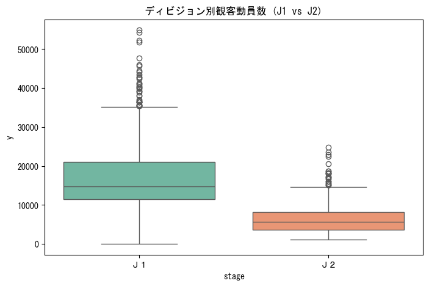
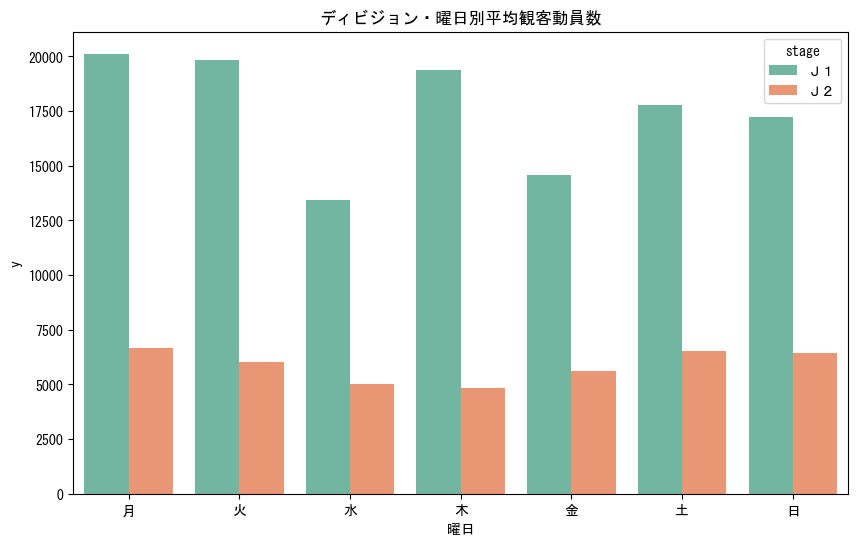
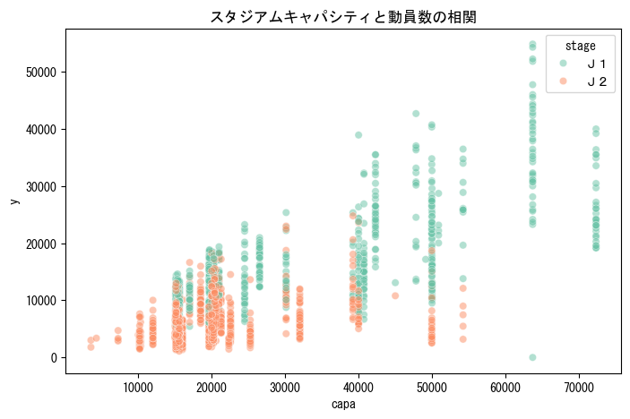

# REPORT_EDA.md (Phase 1: Data Understanding)

## 1-1. エグゼクティブサマリー (Summary)
- **背景:** Jリーグの集客最大化に向け、これまでの観客動員数の変動要因が不明瞭であり、データに基づく客観的な実態把握が求められていた。
- **目的:** 2012-2014年の実績データから、動員数の全体分布およびディビジョン・曜日・スタジアム規模による物理的な格差を明らかにする。
- **結果:** J1平均(1.7万)はJ2平均(0.6万)の約2.7倍であり、さらにJ1では祝日等の変則平日開催（月・火）が最大集客を記録するスパイクを確認した。
- **アクション:** 通常の土曜開催に加え、祝日・大型連休の振替試合を「最大需要日」と定義し、運営リソースを傾斜配分する準備を開始せよ。

## 1-2. 前工程への動線と位置づけ (Context)
- 本レポートは「フェーズ1：データ理解」にあたる。
- 生データの物理的特性を可視化し、思い込みを排した事実ベースのモデル構築を目的とする。

## 1-3. 分析の結果と考察 (Analysis & Findings)

### 1-3-1. ディビジョン(stage)別の構造的格差

※ 箱ひげ図の見方: 中央の太線が中央値、箱の上下がデータの中心50%（第1・第3四分位点）、上下に伸びる線（ひげ）の端が外れ値を除く上下限を示します。
> **So What?: J1とJ2は集客のフェーズそのものが別物。全分析においてディビジョンを主軸に据えるべき。**
- J1平均: 17,409人 / J2平均: 6,308人。

### 1-3-2. 曜日別の集客パターン（ディビジョン別）

> **So What?: J1では月・火の変則開催が平均2万人を超え、土日を上回るピークを形成している。これは祝日等の特殊カードに限定されるため、一点豪華なリソース集中が必要。**
- **J1実態:** 5(土)の平均1.77万人に対し、0(月)は2.01万人、1(火)は1.98万人を記録。
- **J2実態:** 曜日にかかわらず、5(土)・6(日)・0(月)が6.5千人前後で並び、集客が分散している。

### 1-3-3. スタジアムキャパシティとの相関

> **So What?: キャパが天井となっている試合が散見される。特にJ1のピーク曜日（土・月・火）における「機会損失」の解消が重要。**

## 1-4. 結論と今後のアクション (Conclusion & Recommendations)
- **結論:** 「土曜＝最大」というバイアスを捨て、カレンダー上の特殊要因（祝日、大型連休）を正確に特徴量化する必要がある。
- **次の一手:** [ISSUE-02] にて、月・火のスパイクを説明するための「祝日フラグ」や「連休中フラグ」の検討を開始する。
