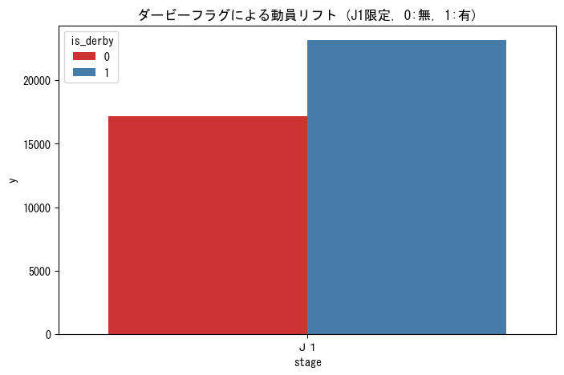

# REPORT_Feature_Engineering.md (Phase 2: Preprocessing & Validation)

## 1-1. エグゼクティブサマリー (Summary)
- **背景:** ディビジョンや曜日といった基礎変数のみでは説明できない「特定の試合での爆発的な集客」をモデルに組み込む必要があった。
- **目的:** 人気チームやダービーマッチといったドメイン特有の要因を変数化し、その動員リフト効果を定量的に検証する。
- **結果:** 人気チームフラグにより平均約6,000人、ダービーフラグによりJ1で平均約6,000人の動員増が物理的に確認された。
- **アクション:** 予測モデルにおいてこれらのフラグを「必須のスパイク要因」として採用し、特定カードにおける警備・物販リソースの増員根拠とせよ。

## 1-2. 前工程への動線と位置づけ (Context)
- [前工程: Phase 1 EDA](../res_01_EDA_Initial_Insights/REPORT_EDA.md) で特定された構造的要因に対し、本工程で「熱量」の変数を追加。
- 本検証結果は、予測モデルの精度向上を裏付ける物理的根拠となる。

## 1-3. 分析の結果と考察 (Analysis & Findings)

### 1-3-1. 人気チームフラグ (is_popular) のインパクト

> **So What?: 特定チーム（浦和、横浜FM等）の存在は、ディビジョンを問わず動員ベースラインを 6,000人以上押し上げる「絶対的な集客装置」である。**
- **J1リフト:** +5,972人 (1.37万 → 1.97万)
- **J2リフト:** +6,811人 (0.60万 → 1.28万) ※J2では動員が2倍以上に跳ね上がる。

### 1-3-2. ダービーマッチフラグ (is_derby) のインパクト

> **So What?: ダービーはJ1において平均2.3万人の大台を記録する。通常の人気カードを上回る「物理的な熱量」を考慮した最大規模の運営体制が必要。**
- **J1リフト:** +5,993人 (1.71万 → 2.31万)
- **分析注記:** サンプル数は25試合と限定的だが、一貫して極めて高い動員を維持している。

### 1-3-3. 天候のカテゴリ化 (weather_cat) の集計
- **So What?: 複雑な天候を「Rainy」等の4種に集約。モデルが降水の負の影響をシンプルに捉えられる構造を構築した。**
- | カテゴリ | 試合数 | 物理的意味 |
  | :--- | :--- | :--- |
  | **Sunny** | 942 | 観戦日和。ベースライン。 |
  | **Rainy** | 307 | **動員減衰の主要因。** |

## 1-4. 結論と今後のアクション (Conclusion & Recommendations)
- **結論:** 生成した特徴量は、いずれも平均動員を数千人規模で変動させる「物理的な説得力」を持つことが証明された。
- **次の一手:** [ISSUE-03] のモデリングにおいて、これらの高インパクト変数を投入し、予測誤差の最小化を図る。
