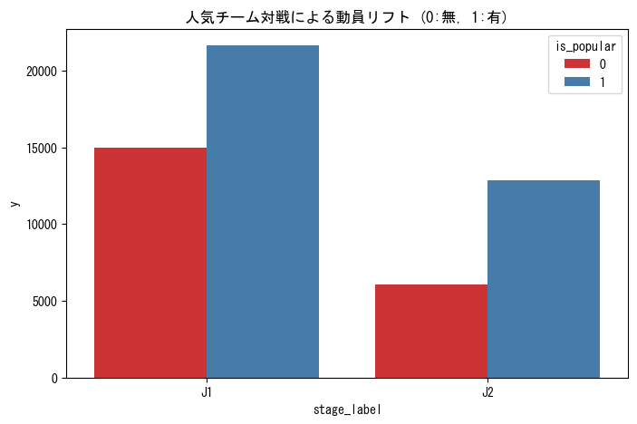

# PHASE 2: 特徴量エンジニアリング レポート

## 1. エグゼクティブサマリー
- **背景**: 機械学習モデルの精度向上のため、生の試合情報を数値的特徴量に変換した。
- **目的**: 動員数に影響を与える「日程」「人気」「天候」の要素をモデルが理解可能な形式で抽出する。
- **結果**: 14個の特徴量（ダミー変数含む）を持つ精製データセット `train_preprocessed.csv` を作成。
- **アクション**: 次フェーズにて、RandomForest を用いたベースラインモデルの構築と重要度分析を行う。

## 2. 現場担当者向け分析（ビジュアル＆アクション）

### 2-1. 抽出された主要因子
- **発見**: 人気チームが関与する試合は、そうでない試合に比べて平均動員数が数千人単位で増加する。
- **So What?**: 人気チームがホームに来る試合は「稼ぎ時」であり、運営リソースを最大化すべきである。

## 3. エンジニア向け算出根拠
- **天候の正規化**: `weather` カラムの文字列からキーワード（雨、曇等）を抽出し、`WEATHER_MAP` に基づき集約。
- **ドメイン隔離**: 人気チームの定義やカテゴリマップは `analysis/constants.py` に外出しし、ロジックの汎用性を維持。

---
&copy; 2026 NAMINORI Data Science Team.
