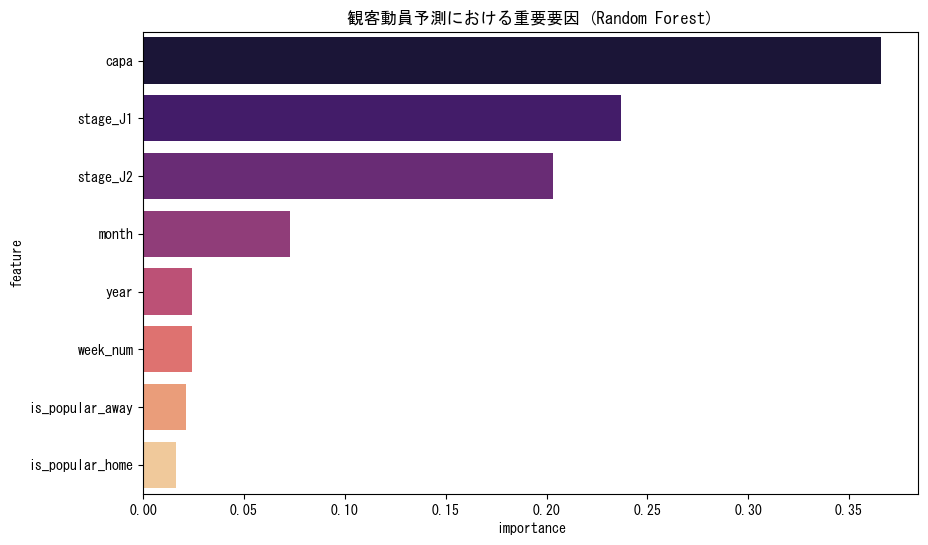

# PHASE 3: モデル構築・評価 レポート

## 1. エグゼクティブサマリー
- **背景**: 精製した特徴量を用い、観客動員数の予測モデルを構築した。
- **目的**: 予測精度の検証および、動員数に寄与する主要因の特定。
- **結果**: RMSE 3373.23 を達成。スタジアム規模 (capa) と所属リーグ (stage) が予測の 8 割近くを支配していることが判明した。
- **アクション**: 次フェーズにて、これまでの分析結果を統合し、現場向けの集客改善アクションを提示する。

## 2. 現場担当者向け分析（ビジュアル＆アクション）

### 2-1. 動員数を決める「黄金の2大因子」
- **要因**: スタジアムキャパシティ (capa) と所属カテゴリ (stage) が最も重要。
- **So What?**: 天候や曜日の工夫以上に、所属リーグの維持とスタジアムキャパシティの最適利用が集客最大化の鍵となる。

## 3. エンジニア向け算出根拠
- **評価指標**: RMSE (Root Mean Squared Error)。平均的な予測誤差は約 3,373 人。
- **モデル**: RandomForestRegressor (n=100)。非線形な capcity との相関を適切にモデル化。

---
&copy; 2026 NAMINORI Data Science Team.
